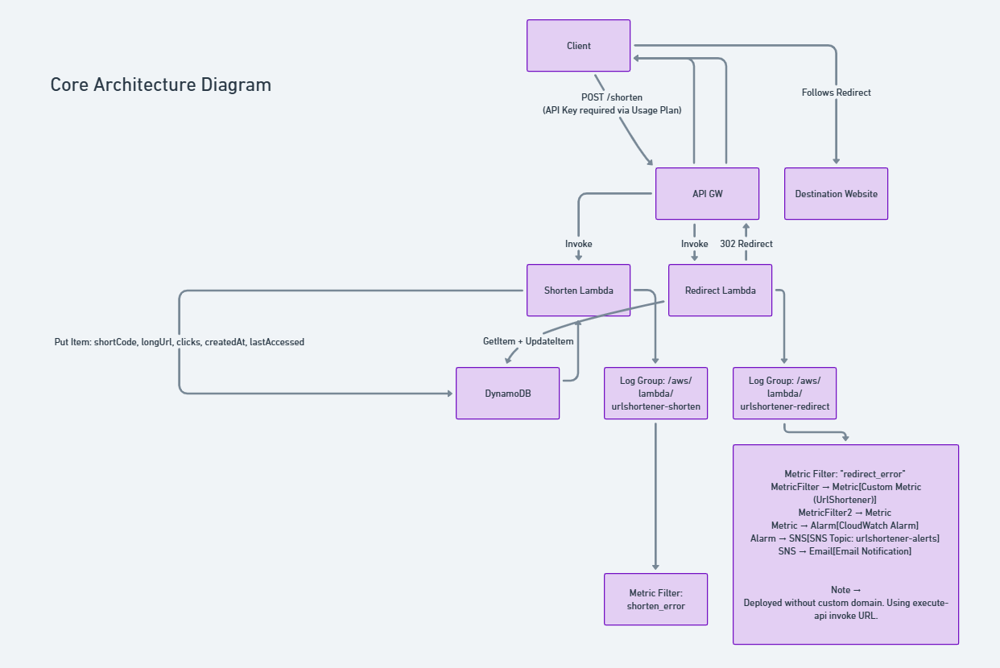
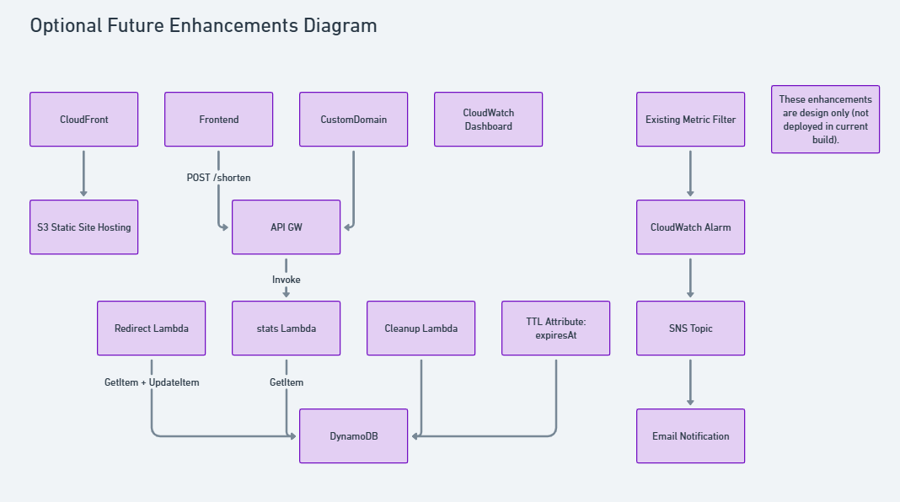

# Serverless URL Shortener on AWS

Deployed a production style, serverless URL shortener API built on AWS using managed services.  
This project exposes endpoints to create short URLs and redirect users using HTTP 302 responses, with built-in monitoring and basic abuse protection.

---

## Project Status

**Core implementation complete**  
**Security and monitoring enhancements implemented**  
**Future enhancements documented**

---

## Project Goal

Design and deploy a Bitly style URL shortener API that demonstrates:

- Serverless API design using AWS-native services
- Stateless compute with durable storage
- Secure, cost aware architecture aligned with AWS Free Tier
- Operational visibility through logging, metrics, and alerts

---

## Current Architecture (Deployed)

### High-Level Flow

**Client**
→ **Amazon API Gateway (REST API)**
→ **AWS Lambda (Python 3.11)**
→ **Amazon DynamoDB**

Error conditions are logged to CloudWatch, transformed into custom metrics, and surfaced via alarms and SNS email notifications.

### Core Architecture Diagram



---

## AWS Services Used

- **Amazon API Gateway**
  - REST API with Lambda proxy integration
  - Separate POST and GET methods
  - Usage plan and API key applied to POST endpoint

- **AWS Lambda**
  - `urlshortener-shorten`: generates short codes and stores mappings
  - `urlshortener-redirect`: resolves short codes and issues HTTP 302 redirects

- **Amazon DynamoDB**
  - On-demand table (`UrlShortener`)
  - Primary key: `shortCode`
  - Stores URL mappings and access metadata

- **AWS IAM**
  - Least privilege execution role for Lambda
  - Explicit permissions for DynamoDB and CloudWatch logs

- **Amazon CloudWatch**
  - Per function log groups
  - Custom metric filters for error detection
  - Alarms integrated with SNS for email alerts

- **Amazon SNS**
  - Email notifications for operational errors

---

## Security & Reliability Controls

- API Gateway **API Key + Usage Plan** protecting `POST /shorten`
- Least privilege IAM roles
- DynamoDB conditional writes to prevent short code collisions
- Input validation for URL format and length
- Structured logging for troubleshooting
- Custom CloudWatch metrics for error visibility

## API Endpoints

### Create Short URL

**POST `/shorten`**

Creates a short URL mapping for a provided long URL.

**Request Body**
```json
{
  "url": "https://example.com"
}

**Response**
{
  "shortUrl": "https://<api-id>.execute-api.<region>.amazonaws.com/prod/Ab12Cd",
  "code": "Ab12Cd"
}
```

**Redirect to Original URL**
```json
  GET /{shortCode}
```
Redirects the client to the original long URL.
  - Public endpoint
  - Returns an HTTP 302 redirect with a location header


---

## What This Project Demonstrates

- End-to-end serverless API design
- Practical use of API Gateway Lambda proxy integration
- Stateless compute with persistent storage
- Secure API patterns (API keys, least privilege)
- Operational monitoring with CloudWatch metrics and alarms
- Real world troubleshooting of API Gateway and Lambda behavior

---

## Future Enhancements (Not Deployed)

These enhancements were intentionally scoped out of the deployed build but are represented in the optional architecture diagram.

### Optional Architecture Diagram

Planned enhancements include:

- Custom domain with Route 53 and ACM
- Frontend UI hosted on S3 + CloudFront
- `/stats/{shortCode}` analytics endpoint
- TTL based expiration with cleanup Lambda
- CI/CD deployment using AWS SAM or GitHub Actions
- CloudWatch dashboards for traffic and error trends



---

## Key Takeaway

This project demonstrates how to build and operate a secure, serverless API on AWS using managed services only. It emphasizes correctness, observability, and cost awareness over unnecessary complexity.
