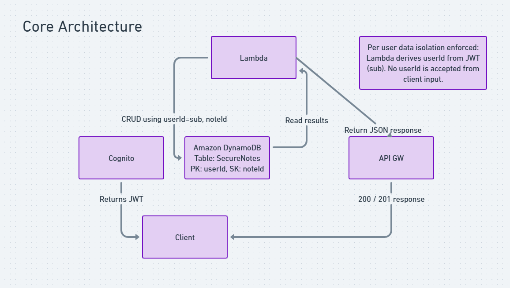

# Secure Notes API on AWS (Cognito + Serverless)

Deployed a secure, serverless Notes API on AWS that allows authenticated users to create, read, update, and delete their own notes.  
The system enforces strict per-user data isolation using Amazon Cognito JWTs and a serverless backend built entirely on managed AWS services.

---

## Project Status

- **Core implementation complete**
- **Authentication and authorization fully enforced**
- **Future enhancements documented (not deployed)**

---

## Project Goal

Design and deploy a multi-user backend API that demonstrates:

- Secure authentication using Amazon Cognito
- Token-based authorization enforced at the API layer
- Per-user data isolation with DynamoDB
- Stateless serverless compute using AWS Lambda
- Clean, defensive API design with explicit error handling

---

## Current Architecture (Deployed)

### High-Level Flow

**Client**  
→ **Amazon Cognito User Pool** (sign-up / sign-in, JWT issuance)  
→ **Amazon API Gateway (Cognito Authorizer)**  
→ **AWS Lambda (Python 3.11)**  
→ **Amazon DynamoDB**

User identity is derived exclusively from the JWT (`sub` claim).  
No user identifiers are ever accepted from client input.

### Core Architecture Diagram



---

## AWS Services Used

### Amazon Cognito (User Pools)
- User registration and authentication
- Issues signed JWTs used for API authorization

### Amazon API Gateway
- REST API with Lambda proxy integration
- Cognito User Pool Authorizer attached to all methods

### AWS Lambda
- Single handler implementing all CRUD operations
- Stateless execution with identity derived from JWT claims

### Amazon DynamoDB
- On-demand table (`SecureNotes`)
- Composite primary key:
  - Partition key: `userId` (JWT `sub`)
  - Sort key: `noteId`

### AWS IAM
- Least privilege execution role for Lambda
- Explicit DynamoDB and CloudWatch Logs permissions

### Amazon CloudWatch
- Per-function log group for execution visibility
- Execution and error logs captured in CloudWatch for validation and troubleshooting

---

## Security & Data Isolation Design

- Cognito User Pool Authorizer enforced at API Gateway
- User identity derived from JWT `sub` claim only
- No client supplied user identifiers accepted
- Per-user partitioning in DynamoDB
- Least privilege IAM policies
- Explicit error responses (401 / 403 / 404)

This design prevents:
- Cross-tenant data access
- User impersonation
- Accidental data leakage

---

## API Endpoints

### Create Note

**POST `/notes`**

Creates a new note for the authenticated user.

**Request Body**
```json
{
  "text": "First secure note"
}
```

**Response**
```json
{
  "userId": "<derived-from-jwt>",
  "noteId": "<uuid>",
  "text": "First secure note",
  "createdAt": 1768492895,
  "updatedAt": 1768492895
}
```
---
### List Notes

**GET `/notes`**

Returns all notes belonging to the authenticated user.

---
### Get Note by ID

**GET `/notes/{id}`**

Retrieves a single note owned by the authenticated user.

- Returns `404` if the note does not exist or does not belong to the user.

---
### Update Note

**PUT `/notes/{id}`**

Updates the text of an existing note.

---
### Delete Note

**DELETE `/notes/{id}`**

Deletes a note owned by the authenticated user.

---

### Unauthorized Access

Requests without a valid JWT return

```json
{
  "error": "Unauthorized"
}
```
---

## What This Project Demonstrates
  - Secure authentication vs authorization boundaries
  - Cognito based JWT enforcement at API Gateway
  - Stateless serverless API design
  - Multi-tenant data modeling with DynamoDB
  - Zero trust backend principles
  - Defensive error handling and input validation
  - Real world AWS service integration without overengineering
  
---

## Future Enhancements (Not Deployed)

The following enhancements were intentionally scoped out of the deployed build but are documented to show forward-looking architectural planning.

### Optional Architecture Diagram


**Future enhancements could include**
  - Infrastructure as Code using AWS SAM or GitHub Actions
  - Presigned S3 uploads for note attachments
  - Additional Lambda routes for attachment handling
  - Client direct uploads using secure presigned URLs
  - Expanded monitoring and alerting
  - Pagination and search enhancements

---

## Key Takeaway

> This project demonstrates how to design and deploy a secure, multi-user, serverless API on AWS using managed services only. It emphasizes correctness, data isolation, and security boundaries over unnecessary complexity.
